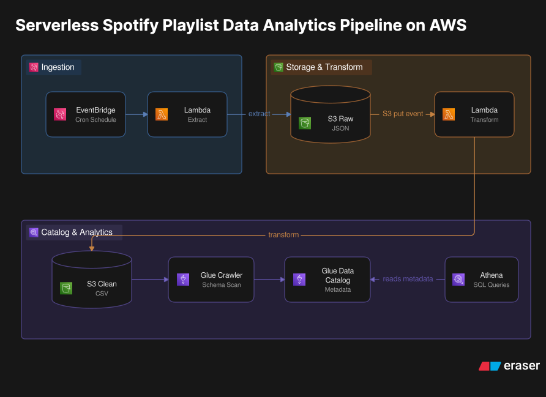

🎵 Serverless Spotify Data Analytics Pipeline on AWS

🛠️ Tech Stack & Skills Demonstrated
* Languages: Python (3.14 Runtime), SQL
* Cloud Compute & Orchestration: AWS Lambda, Amazon EventBridge
* Storage & Data Lake Infrastructure: AWS S3 (Raw and Transformed tier isolation), AWS IAM (Least-Privilege Role Policies)
* Data Cataloging & Metadata Management: AWS Glue (Crawlers, Data Catalog)
* Serverless Analytics Engine: Amazon Athena

🏗️ System Architecture
The architecture utilizes a modern serverless cloud data lake pattern, converting unstructured API payloads into a schema-enforced, globally cataloged analytical layer.

Serverless Data Lifecycle:
1. Extraction & Orchestration: An Amazon EventBridge cron expression triggers an AWS Lambda function (Python 3.14). The Lambda authenticates via OAuth 2.0 with the Spotify Web API, pulls a comprehensive playlist payload, and lands the raw JSON into a s3 raw data bucket.
2. Event-Driven Transformation: The raw ingestion triggers a downstream Transformation Lambda Function. This script extracts deeply nested structures (e.g., song metadata, artist arrays, album metadata), enforces data types, and writes flat CSV files into a s3 transformed data bucket
3. Automated Schema Discovery: An AWS Glue Crawler automatically scans the clean CSV bucket and can do this on a set schedule or event trigger. It infers table definitions, detects schema drift, and registers the metadata into the centralized AWS Glue Data Catalog.
4. Serverless Ad-Hoc Analytics: Business analysts query the structured playlist data directly from S3 using Amazon Athena, executing standard ANSI SQL statements without provisioning an active data warehouse.

📊 Transformed Data Catalog Schema
Once processed and cataloged by AWS Glue, the dataset exposes structured tables optimized for tabular querying in Amazon Athena:
* songs Table: Captures transactional data including song_id, song_name, duration_ms, song_added.
* artists Table: Flattens the array of multi-artist entries to track artist_id, artist_name, and external profile links.
* albums Table: Contains dimension metrics for album_id, album_name, release_date, and total_tracks.

⚡ Engineering Decisions & Trade-Offs
* Why Use AWS Lambda Instead of AWS Glue ETL (Spark)?
    AWS Glue ETL jobs invoke full Apache Spark clusters, which carry a minimum 1-minute billing overhead and slower start times. Because Spotify playlist extractions handle megabytes rather than terabytes of data, AWS Lambda executes the entire processing workload in milliseconds for a fraction of the cost.
* Choosing S3 + Athena Over a Relational Database (RDS PostgreSQL):
    An RDS instance runs 24/7, continuously billing for compute and idle resources. Combining S3 with Amazon Athena enables an on-demand query model: storage costs pennies per gigabyte, and queries cost roughly $5 per terabyte scanned, scaling down to $0 when idle.
* Leveraging AWS Glue Crawlers vs. Manual DDL Statements:
    Instead of manually executing hardcoded CREATE EXTERNAL TABLE definitions in Athena, the Glue Crawler provides future-proof resilience. If Spotify alters its payload fields or adds new metadata, the Crawler automatically handles the schema drift and updates the catalog dynamically.